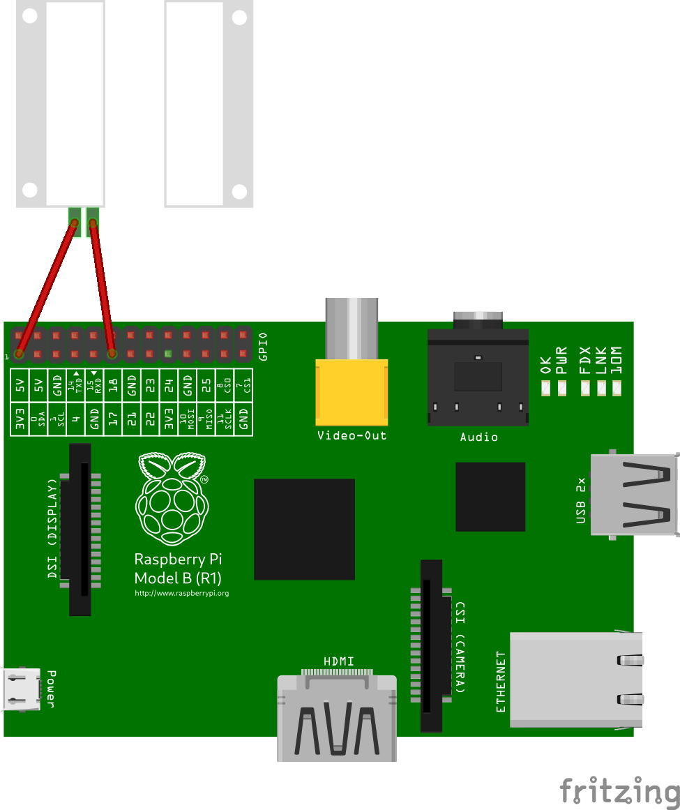

RPi.MC
######

Magnetic contact state monitor, completely written in Python.

RPi.MC is using magnetic contact switch (door/window sensor) with Raspberry Pi GPIO.

To connect to Raspberry Pi plug into `GPIO PIN 17 <https://pinout.xyz/pinout/pin11_gpio17#>`_ (Physical pin 11) and
POWER PIN. Install and execute raspi-mc and it should work. Alternatively you can user different PIN and execute
raspi-mc with parameter: ``raspi-mc --pin pin_number``.

RPi.MC supports number of parameters and also configuration file. For more details see ``raspi-mc --help`` or sample
config.

Sensor is based on `RPi.Sensor <https://github.com/ricco386/RPi.Sensor/>`_ library, which make base for implementing
different types of sensors in Python.

Pre-Installation requirements
-----------------------------

- Update system and install required dependencies::

    sudo apt-get update

- Update system and install required dependencies::

    sudo apt-get install build-essential python3-dev python3-pip

Installation
------------

- Install the latest released version using pip::

    pip install https://github.com/ricco386/RPi.MC/zipball/master

- Alternatively install latest released version from pypi::

    pip install --upgrade RPi.MC

Integration as a systemd service
--------------------------------

- Make sure all dependencies (listed below) are installed (done automatically when installing via pip)
- The ``raspi-mc`` command should be installed somewhere in your ``PATH`` (done automatically when installing via pip), make sure `raspi-mc.service` has corect path in `ExecStart` set to `raspi-mc` executable.
- Systemd scripts are available: https://github.com/ricco386/RPi.MC/tree/master/init.d to install them you will need root privileges, so we execute them as sudo::

    sudo cp init.d/raspi-mc.conf /etc/tmpfiles.d/
    sudo cp init.d/raspi-mc.service /etc/systemd/system/
    sudo systemd-tmpfiles --create /etc/tmpfiles.d/raspi-mc.conf
    sudo systemctl enable raspi-mc.service  # Enable service to start at system boot
    sudo systemctl start raspi-mc.service  # Start

Systemd scripts should be run under **default Raspberry Pi user** (pi), scripts have to be able access GPIO.

**Dependencies:**

- `RPi.Sensor <https://pypi.python.org/pypi/RPi.Sensor>`_ (0.5.3+)

Usage
-----

You have to create a `.sensor.cfg` file and place into `/home/pi/.sensor.cfg` you can find example file in RPi.Sensor repo: https://github.com/ricco386/RPi.Sensor/blob/master/raspi_sensor/sensor.cfg.example and create section `[Magnetic_Contact]` where you can override default values.

`raspi-mc` also support multiple parameters to overwrite config parameters. For more info run::

    raspi-mc --help

Zabbix support
--------------

In directory `zabbix_template` there is a Zabbix template that can be imported to Zabbix and monitor systemd process if it is running and how much memorry it consumes. It also supports Zabbix trapper `rpi.mc-state` that can receive a sensor state changes.

License
-------

For more information see the `LICENSE <https://github.com/ricco386/RPi.MC/blob/master/LICENSE>`_ file.
